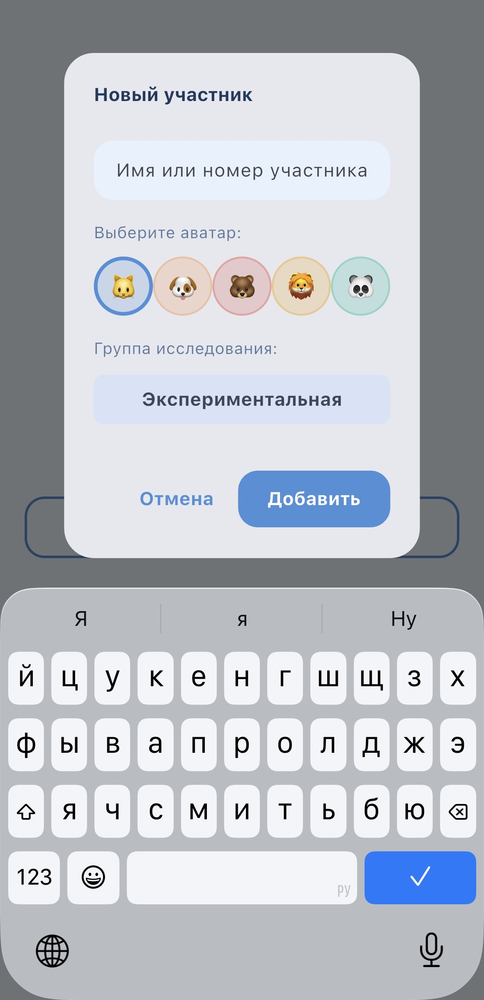
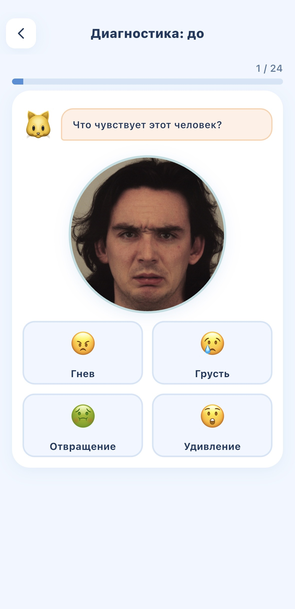
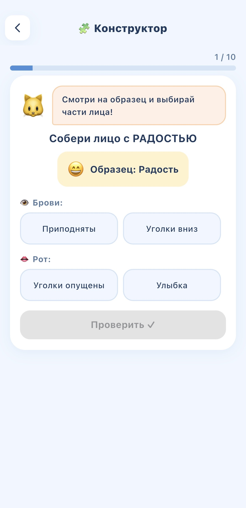
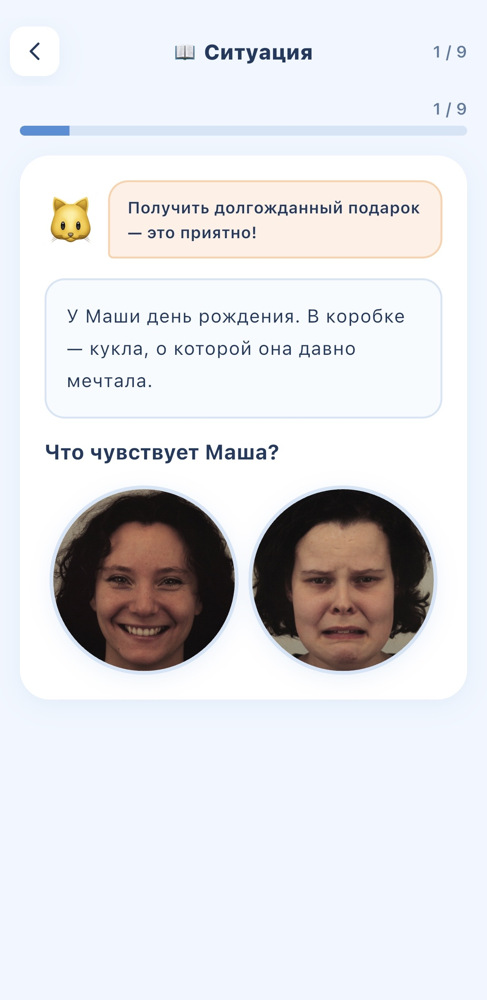
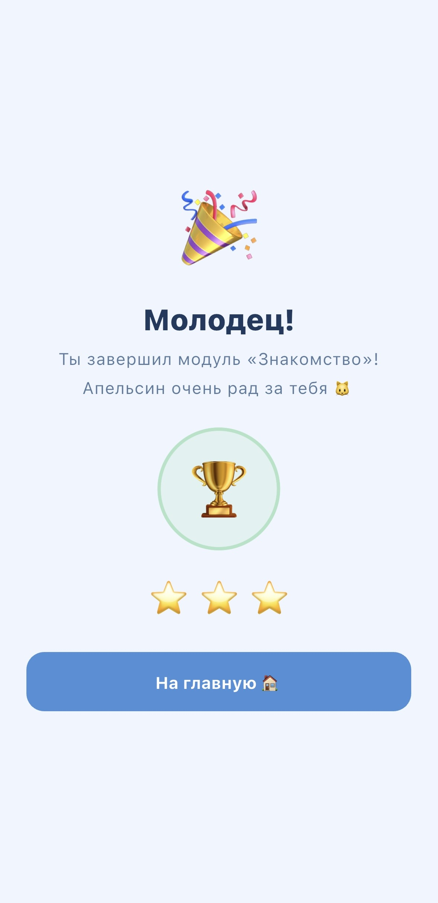
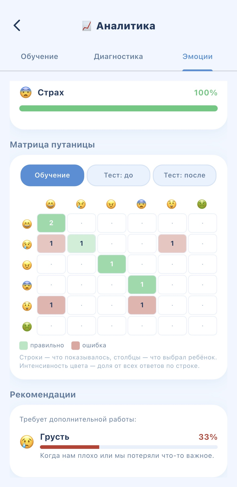

<div align="center">
  

# Мир эмоций

  **Игровое мобильное приложение для развития навыка распознавания базовых эмоций у школьников с расстройством аутистического спектра**

  
  
  
  
  
  
  

</div>

---

## О проекте

«Мир эмоций» — мобильное обучающее приложение, разработанное в рамках выпускной квалификационной работы. Целевая аудитория — школьники с расстройством аутистического спектра (РАС), испытывающие затруднения в распознавании базовых эмоций на лицах других людей.

Приложение реализует **квазиэкспериментальную схему** с экспериментальной и контрольной группами и двумя измерениями (pre/post-тест с обучающим блоком между ними) и предоставляет педагогу/родителю аналитику эффективности обучения в реальном времени.

### Теоретическая база

- Классификация **шести базовых эмоций по Полу Экману**: радость, грусть, гнев, страх, удивление, отвращение
- Методика **социальных историй** Кэрол Грей (Social Stories™) — основа третьего обучающего модуля
- Принцип нарастающей когнитивной нагрузки: от прямого узнавания фотографий до понимания эмоционального контекста

---

## Возможности

### Для ребёнка

- **Диагностика** — pre-test и post-test, две параллельные формы A/B с контрбалансировкой
- **Три обучающих модуля** с разными типами заданий:
  - *Знакомство* — выбор эмоции из фотографий
  - *Конструктор* — сборка эмоции по частям лица
  - *Ситуации* — социальные истории
- **Адаптивная сложность** — алгоритм автоматически подстраивает количество вариантов ответа под текущую точность (порог +1 уровня: 85 %, −1 уровня: 70 %)
- **Персонаж-помощник** — кот Апельсин даёт подсказки и поощряет
- **Таймер сессии** с мягким завершением — защита от переутомления
- **Система наград** — анимированный экран завершения модуля

### Для педагога / родителя

- **Несколько профилей участников** на одном устройстве, с разделением на экспериментальную и контрольную группы
- **PIN-защита** настроек и аналитики
- **Аналитика в реальном времени**: точность по каждой эмоции, время реакции, матрица путаницы, динамика по сессиям, сравнение pre/post
- **CSV-экспорт** для научной обработки данных (детальный и сводный, по одному профилю или агрегированно)
- **Резервное копирование** всех данных одним JSON-файлом
- **Полная офлайн-работа** — без сервера, без аккаунтов, без интернета

---

## Скриншоты

<div align="center">

|                 Профиль и группа                 |                Диагностика                |              Конструктор лица              |
| :------------------------------------------------------------: | :--------------------------------------------------: | :--------------------------------------------------------: |
|          |  |  |
|         **Социальные истории**         |         **Экран награды**         |       **Аналитика педагога**       |
|  |              |            |

</div>

---

## Технологический стек

| Компонент                        | Технология                                                                                                                                                                         |
| ----------------------------------------- | -------------------------------------------------------------------------------------------------------------------------------------------------------------------------------------------- |
| Фреймворк                        | Flutter 3.x (Dart `>=3.0.0 <4.0.0`)                                                                                                                                                        |
| UI                                        | Material Design 3                                                                                                                                                                            |
| Навигация                        | [`go_router`](https://pub.dev/packages/go_router) ^13.0.0                                                                                                                                     |
| Управление состоянием | [`provider`](https://pub.dev/packages/provider) ^6.1.1 (ChangeNotifier)                                                                                                                       |
| Локальное хранилище     | [`shared_preferences`](https://pub.dev/packages/shared_preferences) ^2.2.2                                                                                                                    |
| Анимации                          | [`flutter_animate`](https://pub.dev/packages/flutter_animate) ^4.5.0                                                                                                                          |
| Звук                                  | [`audioplayers`](https://pub.dev/packages/audioplayers) ^5.0.0                                                                                                                                |
| Экспорт и бэкап              | [`share_plus`](https://pub.dev/packages/share_plus) ^10.0.0, [`path_provider`](https://pub.dev/packages/path_provider) ^2.1.0, [`file_selector`](https://pub.dev/packages/file_selector) ^1.0.3 |
| Хэширование                    | [`crypto`](https://pub.dev/packages/crypto) ^3.0.0 (SHA-256 для восстановления PIN)                                                                                          |

**Платформы:** iOS, Android. Ориентация — только портретная.

---

## Установка и запуск

### Требования

- [Flutter SDK](https://docs.flutter.dev/get-started/install) 3.x
- Dart SDK 3.0.0 или выше
- Для iOS: Xcode 14+, CocoaPods
- Для Android: Android Studio с Android SDK 21+

### Сборка

```bash
# Клонировать репозиторий
git clone https://github.com/sa1vador77/emotion_app.git
cd emotion_app

# Установить зависимости
flutter pub get

# Запустить на подключённом устройстве или симуляторе
flutter run

# Сборка релизной версии
flutter build apk        # Android APK
flutter build appbundle  # Android App Bundle (для Google Play)
flutter build ios        # iOS (требует macOS + Xcode)
```

### Перегенерация иконок приложения

```bash
flutter pub run flutter_launcher_icons
```

### Линтинг и тесты

```bash
flutter analyze   # статический анализ (политика нулевых предупреждений)
flutter test      # запуск тестов
```

> Контроль качества опирается на статический анализатор с политикой нулевых предупреждений и натурное приёмочное тестирование с участниками. Набор автоматических тестов минимален (каркас `flutter test`); подробнее о стратегии тестирования — в разделе 4.4 пояснительной записки.

---

## Структура проекта

```
emotion_app/
├── lib/
│   ├── main.dart                  # точка входа, GoRouter, MultiProvider
│   ├── data/                      # пулы заданий
│   ├── models/                    # ChangeNotifier-модели (профили, прогресс, диагностика, таймер)
│   ├── screens/                   # экраны (home, модули, диагностика, аналитика, настройки)
│   ├── services/                  # SoundService, BackupService
│   ├── theme/                     # AppTheme, адаптивная вёрстка
│   └── widgets/                   # переиспользуемые UI-компоненты
├── assets/
│   ├── images/emotions/           # 18 фото для обучения (6 эмоций × 3)
│   ├── images/diagnostic/         # фото для диагностики (формы A/B)
│   └── audio/                     # звуки обратной связи
├── screenshots/                   # скриншоты интерфейса для README
├── data/                          # датасет исследования и кодбук CSV
├── PROJECT.md                     # полная проектная документация
├── RATIONALE.md                   # психологическое обоснование решений
├── CHANGELOG.md                   # история версий
└── pubspec.yaml
```

Подробная карта файлов и описание каждого компонента — в [PROJECT.md](PROJECT.md).

---

## Архитектура

```
┌─────────────────────────────────────────────┐
│                  main.dart                  │
│  MultiProvider → GoRouter → Глобальные UI   │
└────────────────────┬────────────────────────┘
                     │
       ┌─────────────┴─────────────┐
       ▼                           ▼
┌─────────────────┐         ┌──────────────────┐
│    Models       │◄────────│     Screens      │
│ (ChangeNotifier)│ provide │ (Consumer/Watch) │
│                 │         │                  │
│ ProfileModel    │         │ HomeScreen       │
│ ProgressModel   │         │ Module1/2/3      │
│ DiagnosticModel │         │ Diagnostic       │
│ SessionTimer    │         │ Analytics        │
└────────┬────────┘         └──────────────────┘
         │ persists
         ▼
┌────────────────────────────────────┐
│       SharedPreferences            │
│  Ключи с префиксом profile_<id>_*  │
│  Глобальные настройки: global_*    │
└────────────────────────────────────┘
```

### Принципы

- **Изоляция профилей** — данные каждого ребёнка хранятся под префиксом `profile_<id>_`, глобальные настройки педагога — под `global_*`
- **Сегрегация ролей** — экраны `/settings` и `/analytics` защищены PIN, недоступны ребёнку
- **Декларативная маршрутизация** — GoRouter с redirect-правилами автоматически направляет на нужный экран в зависимости от состояния (есть ли PIN, выбран ли профиль, пройден ли онбординг)
- **Сенсорно-безопасная палитра** — мягкие, ненасыщенные тона без резких контрастов (требование для детей с РАС)

---

## Метрики эффективности

Приложение собирает данные для научной обработки:

- **Точность распознавания** (accuracy) — по каждой эмоции и в целом
- **Время реакции** (reaction time, мс) — для каждого ответа
- **Динамика точности по сессиям** — изменение в процессе обучения
- **Сравнение pre/post** — по каждому участнику и между группами

Все данные экспортируются в формате CSV для дальнейшего анализа в статистических пакетах (SPSS, R, Python pandas).

---

## Документация

- [PROJECT.md](PROJECT.md) — полная проектная документация: предметная область, обоснование решений, точные параметры алгоритмов, разделы для ВКР
- [RATIONALE.md](RATIONALE.md) — психологическое обоснование ключевых решений (цвета, звуки, формат заданий, структура диагностики) со ссылками на литературу
- [CHANGELOG.md](CHANGELOG.md) — история версий

---

## Версионирование

Проект придерживается [семантического версионирования](https://semver.org/lang/ru/) (SemVer) вида `MAJOR.MINOR.PATCH`. Текущая версия задана в `pubspec.yaml` (`1.0.0+1`); релизы помечаются git-тегами вида `v1.0.0`. История изменений — в [CHANGELOG.md](CHANGELOG.md).

---

## Лицензия

Проект распространяется под лицензией **MIT** — см. файл [LICENSE](LICENSE). Программный код разработан в рамках выпускной квалификационной работы. Используемые ассеты (фотографии эмоций, звуки) подобраны с учётом лицензий, допускающих некоммерческое использование.
